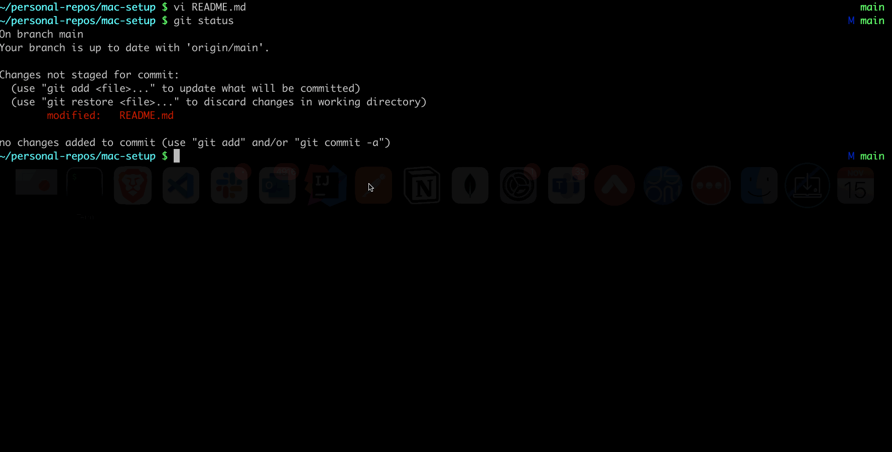

# oh-my-zsh-kylehigginson-theme

My personal theme based on preferred colors and functions.



## Install

1. Install the theme
```
mkdir -p $ZSH_CUSTOM/themes && curl https://raw.githubusercontent.com/kylehigginson/mac-setup/master/zsh/kylehigginson.zsh-theme -L -o $ZSH_CUSTOM/themes/kylehigginson.zsh-theme
```

2. Set the theme in your **.zshrc** file

Vim into the ZSH shell configuration file
```
vi ~/.zshrc
```

Set the theme to `kylehigginson`
```
ZSH_THEME="kylehigginson"
```

3. Reload your updated shell configuration:
```
source ~/.zshrc
```

Done!
